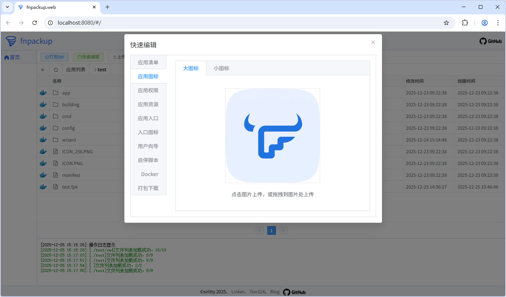

<div align="center">
<p></p> 

# Fnpackup
 

[](https://github.com/snltty/fnpackup)
[](https://github.com/snltty/fnpackup)
[](https://hub.docker.com/r/snltty/fnpackup)

[](https://github.com/snltty/fnpackup/releases)
[](https://mit-license.org/)
[](https://github.com/snltty/fnpackup)
[](https://github.com/snltty/fnpackup)


<a href="https://jq.qq.com/?_wv=1027&k=ucoIVfz4" target="_blank">加入组织：1121552990</a>

</div>

## [🪂]Fnpackup
fnpack二次包装UI，在线编辑和打包fpk，和帮助fpk自动托管静态资源

## [😂]安装方法

1. 在飞牛系统`应用中心`找到应用安装
2. 下载`fnpackup-docker-x64.fpk`到飞牛系统安装
3. 或使用`snltty/fnpackup`Dcker镜像运行，依赖fnpack，监听1069/tcp端口
```
docker run -it -d --name fnpackup \
--network host \
-v /usr/local/fnpackup-docker/projects:/app/projects \
-v /usr/local/fnpackup-docker/statics:/app/statics \
-v /usr/local/bin/appcenter-cli:/app/appcenter-cli:ro \
-v /usr/local/bin/fnpack:/app/fnpack:ro \
-v /var/apps:/app/apps:ro \
--restart=always \
--privileged=true \
snltty/fnpackup
```

## [📦]使用方法

### [💼]打包fpk
1. **创建应用**：在应用列表目录，选择创建应用，或导入已有的.fpk文件
2. **进入应用**：双击应用文件夹
3. **上传程序**：原生应用上传你的程序到`app/server`中，Docker应用直接编辑`app/docker/docker-compose.yaml`
4. **编辑方式**：可以使用`快速编辑`，或双击文件单独编辑，或右键文件源码编辑
5. **打包应用**：编辑好全部内容后打包fpk，在项应用文件夹下查看生成的fpk文件

### [🌍]静态托管

如果你有一些静态网页，或纯静态内容的fpk，专门写一个HTTP/cgi服务,都实在太麻烦了，本程序帮你托管。

使用`http://{appname}.domain.com:1069`或`http://ip:1069/{appname}`访问。

1. 是fpk里的静态内容
    1. 打包fpk时，manifest里添加字段`fnpackup`
    2. 可以`fnpackup={目录}`或`fnpackup={目录}/{下级目录}`，目录级数不限
    3. manifest里的appname就是`{appname}`
2. 就纯静态网页
    1. 安装fnpackup后，找到`文件管理/应用文件/fnpackup-docker/statics/`
    2. 在里面下新建一个文件夹，上传你的静态资源
    3. 文件夹名称就是`{appname}`

然后


## [🖼️]预览效果



## [🎁]为爱发电

若此项目对您有用，可以考虑对作者稍加支持，让作者更有动力，在项目上投入更多时间和精力。


## [👏]特别说明

[](https://github.com/snltty/fnpackup/graphs/contributors)

[](https://www.star-history.com/#snltty/fnpackup&Date)


